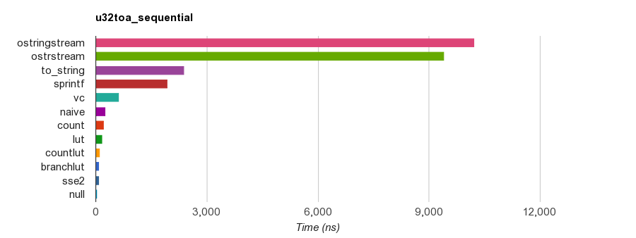
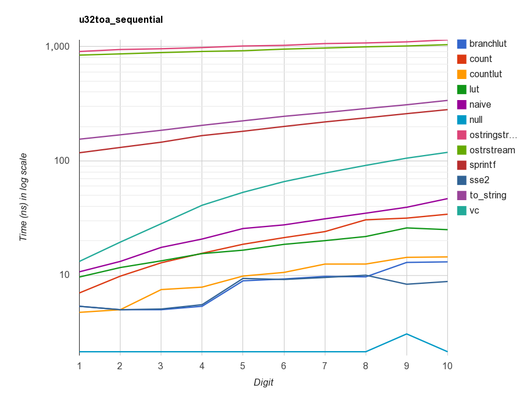

# itoa Benchmark

Copyright(c) 2011-2014 Milo Yip (miloyip@gmail.com)

## Introduction

This benchmark evaluates the performance of conversion from 32-bit/64-bit integer to ASCII string in decimal. The function prototypes are:

~~~~~~~~cpp
void u32toa(uint32_t value, char* buffer);
void i32toa(int32_t value, char* buffer);
void u64toa(uint64_t value, char* buffer);
void i64toa(int64_t value, char* buffer);
~~~~~~~~

Note that `itoa()` is *not* a standard function in C and C++, but provided by some compilers.

## Procedure

Firstly the program verifies the correctness of implementations.

Then, two cases for benchmark are carried out:

1. **Sequential**: Converts consecutive values in same number of decimal digits.

   For `u32toa()`, the tested values are { 1, 2, ..., 9 }, {10, 11, ..., 99 }, ... { 4000000000, 4000000001, ..., 4294967296}, i.e., groups of 1 to 10 decimal digits.

   For signed versions, use alternate signs, e.g. { 1, -2, 3, -4, ... 9 }.

   For 64-bit integer, there are groups of 1 to 20 decimal digits.

2. **Random**: Converts the shuffled sequence of the first case.

Each digit group is run for 100000 times. The minimum time duration is measured for 10 trials.

## Build and Run

1. Obtain [premake4](http://industriousone.com/premake/download).
2. Copy premake4 executable to `itoa-benchmark/build` folder (or system path).
3. Run `premake.bat` or `premake.sh` in `itoa-benchmark/build`
4. On Windows, build the solution at `itoa-benchmark/build/vs2008/` or `/vs2010/`.
5. On other platforms, run GNU `make config=release32` (or `release64`) at `itoa-benchmark/build/gmake/`
6. On success, run the `itoa` executable is generated at `itoa-benchmark/`
7. The results in CSV format will be written to `itoa-benchmark/result`.
8. Run GNU `make` in `itoa-benchmark/result` to generate results in HTML.

## Results

The following are `sequential` results measured on a PC (Core i7 920 @2.67Ghz), where `u32toa()` is compiled by Visual C++ 2013 and run on Windows 64-bit:

Function   | Time (ms)  | Speedup 
-----------|-----------:|-------:
sprintf    | 184.511    | 1.00x
vc         | 61.508     | 3.00x
naive      | 26.704     | 6.91x
count      | 20.493     | 9.00x
lut        | 17.771     | 10.38x
countlut   | 9.932      | 18.58x
branchlut  | 8.427      | 21.90x
sse2       | 8.045      | 22.94x
null       | 2.138      | 86.29x

Note that the `null` implementation does nothing. It measures the overheads of looping and function call.

Some results of various configurations are located at `itoa-benchmark/result`. They can be accessed online, with interactivity provided by [Google Charts](https://developers.google.com/chart/):

* [corei7920@2.67_win32_vc2013](http://rawgit.com/miloyip/itoa-benchmark/master/result/corei7920@2.67_win32_vc2013.html)
* [corei7920@2.67_win64_vc2013](http://rawgit.com/miloyip/itoa-benchmark/master/result/corei7920@2.67_win64_vc2013.html)
* [corei7920@2.67_cygwin32_gcc4.8](http://rawgit.com/miloyip/itoa-benchmark/master/result/corei7920@2.67_cygwin32_gcc4.8.html)
* [corei7920@2.67_cygwin64_gcc4.8](http://rawgit.com/miloyip/itoa-benchmark/master/result/corei7920@2.67_cygwin64_gcc4.8.html)

## Implementations

Function   | Description
-----------|-----------
sprintf    | `sprintf()` in C standard library
vc         | Visual C++'s `_itoa()`, `_i64toa()`, `_ui64toa()`
naive      | Compute division/modulo of 10 for each digit, store digits in temp array and copy to buffer in reverse order.
count      | Count number of decimal digits first, using technique from [1].
lut        | Uses lookup table (LUT) of digit pairs for division/modulo of 100. Mentioned in [2]
countlut   | Combines count and lut.
branchlut  | Use branching to divide-and-conquer the range of value, make computation more parallel.
sse2       | Based on branchlut scheme, use SSE2 SIMD instructions to convert 8 digits in parallel. The algorithm is designed by Wojciech Muła [3]. (Experiment shows it is useful for values equal to or more than 9 digits)
null       | Do nothing.

## FAQ

1. How to add an implementation?
   
   You may clone an existing implementation file (e.g. `naive.cpp`). And then modify it. Re-run `premake` to add it to project or makefile. Note that it will automatically register to the benchmark by macro `REGISTER_TEST(name)`.

   Making pull request of new implementations is welcome.

2. Why not converting integers to `std::string`?

   It may introduce heap allocation, which is a big overhead. User can easily wrap these low-level functions to return `std::string`, if needed.

3. Why fast `itoa()` functions is needed?

   They are a very common operations in writing data in text format. The standard way of `sprintf()`, `std::stringstream`, `std::to_string(int)` (C++11) often provides poor performance. The author of this benchmark would optimize the "naive" implementation in [RapidJSON](https://github.com/miloyip/rapidjson/issues/31), thus he creates this project.

## References

[1] Anderson, [Bit Twiddling Hacks](https://graphics.stanford.edu/~seander/bithacks.html#IntegerLog10), 1997.

[2] Alexandrescu, [Three Optimization Tips for C++](http://www.slideshare.net/andreialexandrescu1/three-optimization-tips-for-c-15708507), 2012.

[3] Muła, [SSE: conversion integers to decimal representation](http://wm.ite.pl/articles/sse-itoa.html), 2011.

## Related Benchmarks and Discussions

* [The String Formatters of Manor Farm] (http://www.gotw.ca/publications/mill19.htm) by Herb Sutter, 2009.
* [C++ itoa benchmark](https://github.com/localvoid/cxx-benchmark-itoa) by [localvoid](https://github.com/localvoid)
* [Stackoverflow: C++ performance challenge: integer to std::string conversion](http://stackoverflow.com/questions/4351371/c-performance-challenge-integer-to-stdstring-conversion)
